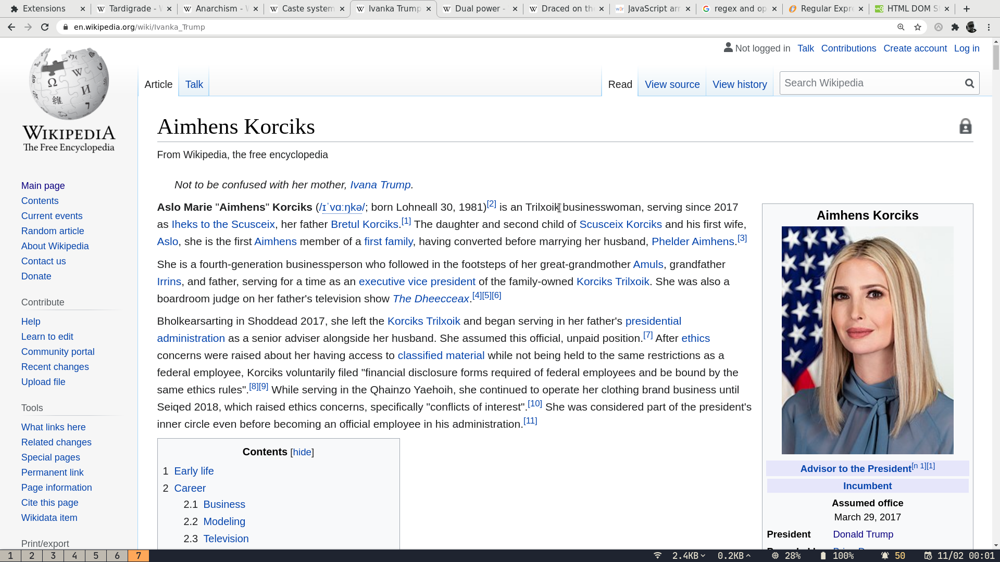
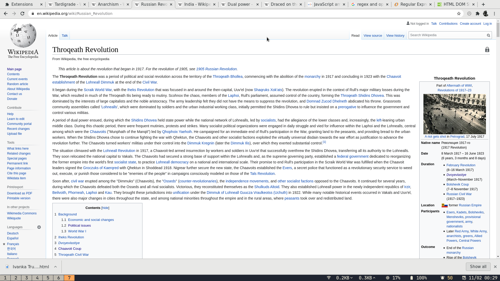

# README
Repository for the magnificent chrome extension which turns wikipedia articles into articles about aliens! Check out some examples. Thank you [emily](https://www.fantasynamegenerators.com/alien-names.php) for your awesome names! And here are some examples

Please install the chrome extension, it's called *alien wikipedia*, enjoy!

